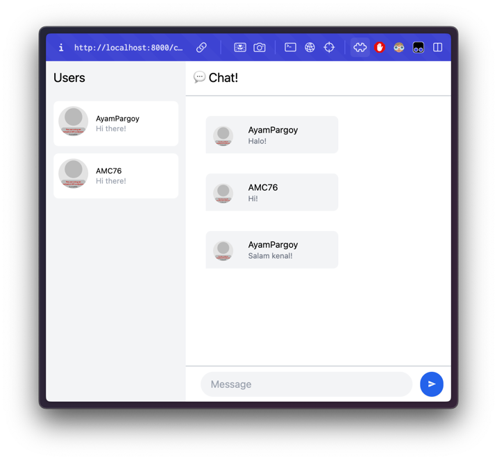
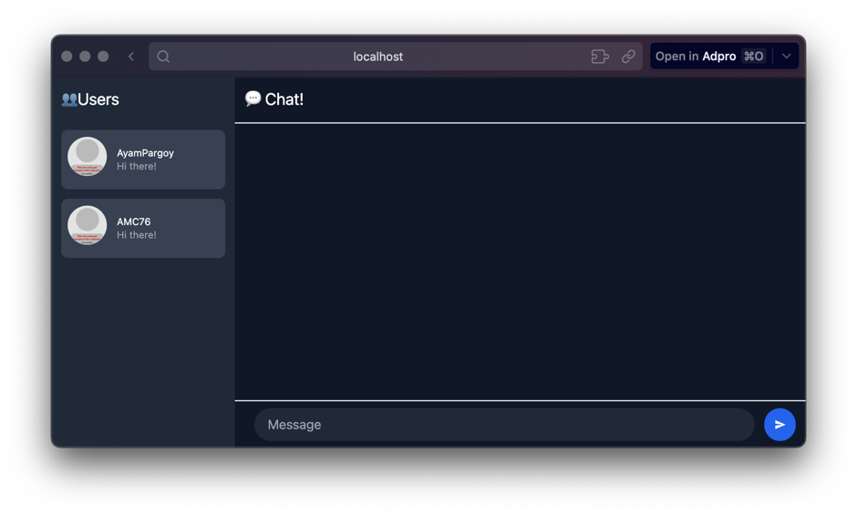

# Tutorial 9 - Advanced Programming - YewChat
**Akmal Ramadhan - 2206081534 - Kelas A**

## Original Code

Setelah menjalankan `npm start` pada YewChat dan Simple WebSocket Server, kita dapat melihat bahwa YewChat dapat berjalan dengan baik. Kita dapat mengirim pesan dan menerima pesan dari _chat room_.

## Add Some Creativities to WebChat

Untuk bagian ini, saya buat WebChat yew versi Dark Mode. Hal yang saya lakukan adalah mengubah warna terang menjadi warna yang gelap.